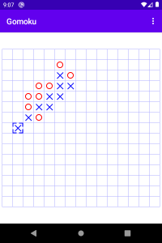

<h1>Gomoku</h1>
Deutsch weiter unten! 

A five-in-a-row game for Android. 
You can build it with AndroidStudio or find the APK in the app folder. 
 
Gomoku is a simple app for playing a short match of five-in-a-row. 
You can chose one of three difficulty levels: 
Easy - a level for beginners who should be able to win after some practice 
Medium - you'll have to be very focused to win at this level 
Hard - the app will defend very aggressively and look out for any of your faults 
 
No records, no series, no permissions, just play... 
 
 
<h1>Gomoku</h1>

Ein Five-In-A-Row-Spiel f&uuml;r Android. 
Sie k&ouml;nnen es mit AndroidStudio &uuml;bersetzen, oder aber die APK im app-Ordner finden. 
 
Gomoku ist eine einfache App für eine schnelle Partie eines Five-In-A-Row-Spiels. 
Sie k&ouml;nnen zwischen drei Schwierigkeitsgraden w&auml;hlen: 
Einfach - ein Level f&uuml;r Anf&auml;nger, die nach etwas &Uuml;bung gewinnen k&ouml;nnen sollten 
Mittel - Sie m&uuml;ssen sehr konzentriert spielen, um in diesem Level zu gewinnen 
Schwer - die App wird sehr aggressiv verteidigen und jeden Ihrer Fehler ausnutzen 
 
Keine Bestenlisten, kein Karrieremodus, keine Berechtigungen, einfach nur spielen... 

